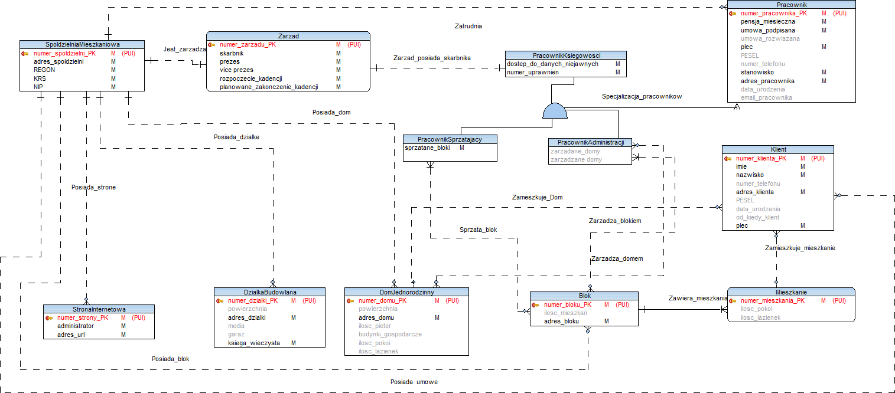
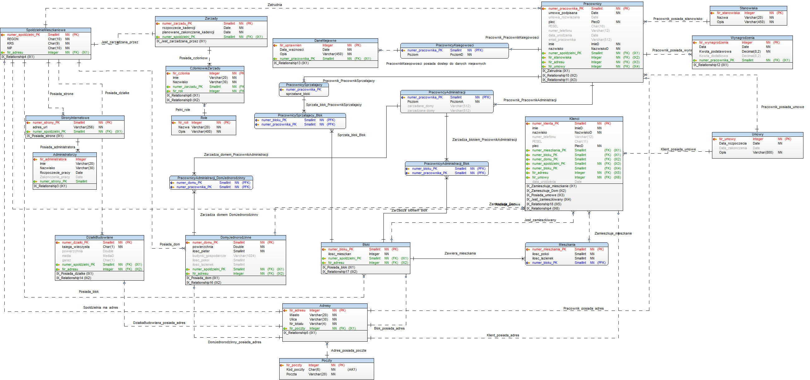

# Oracle Data Models
repo for BDBT course project in Winter '21 semester

## Idea
Presenting basic process of designing relational database:  
1) ER Model
2) Logical Model
3) Physical Model

## Software Used
* Oracle 19c DBMS
* Oracle SQL Developer
* TOAD Data Modeler 7.2

## Installation
1) Install software listed above (since it's OS-dependent won't be described here)
2) Open (and edit if you want) model with TOAD Data Modeller
3) Save model and generate SQL script
4) Create database with generated script (you need to set up Oracle database first)

## Screenshots
* ER Model

* Logical Model

